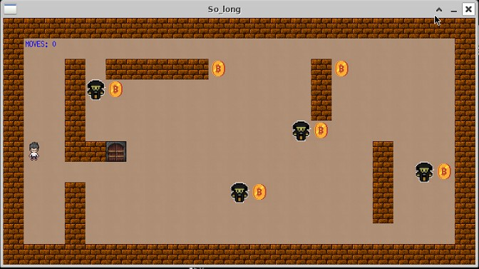

<h1 align="center">
	42cursus' so_long
 </h1>
 
 [](https://github.com/nandajfa/so_long/blob/main/LICENSE)
 
   ## 🗣️ About

> _This project is a very small 2D game.
Its purpose is to make you work with textures, sprites,
and some other very basic gameplay elements._

#### 

The goals of this project are similar to every other goal for this first year: being rigorous,
level up in C programming, use basic algorithms, do some information research, and so
forth. <br/>
So long is a graphic design project. It will help you improve your skills in the following
areas: window management, event handling, colors, textures, and so forth.

### Badge


### Skills

* Imperative programming
* Graphics


## Getting started
**Follow the steps below**
```bash
# Clone the project and access the folder
git clone https://github.com/nandajfa/so_long.git && cd so_long/

# Run make so you can build the game
make

# Run make with bonus if you want to build game with enemies
make bonus

# Run the game with the map as an argument
./so_long_bonus "assets/maps/map_bonus.ber"

# Clean output objects with
make fclean

# Well done!
```

**Game Controller Keys**

**Move:** W, A, S, D or Arrow keys
**Exit:** Q or ESC


### :computer: Technologies

* [C](https://devdocs.io/)
* [Makefile](https://www.gnu.org/software/make/manual/make.html)
* [Minilibx](https://github.com/42Paris/minilibx-linux)

 ### Author

Made by jessica Fernanda 👋 [See my linkedin](https://www.linkedin.com/in/jessica-fernanda-alves-marques-106651205/)
